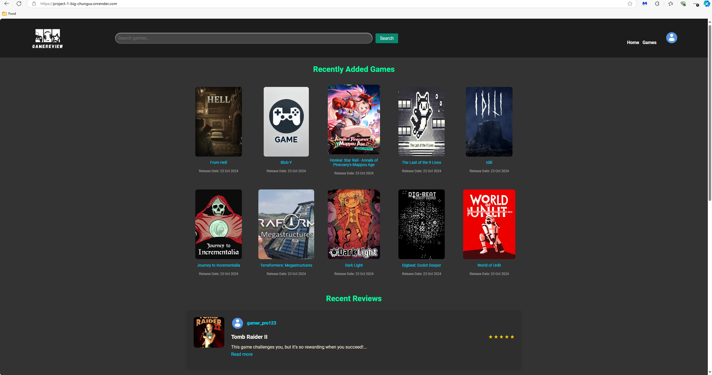
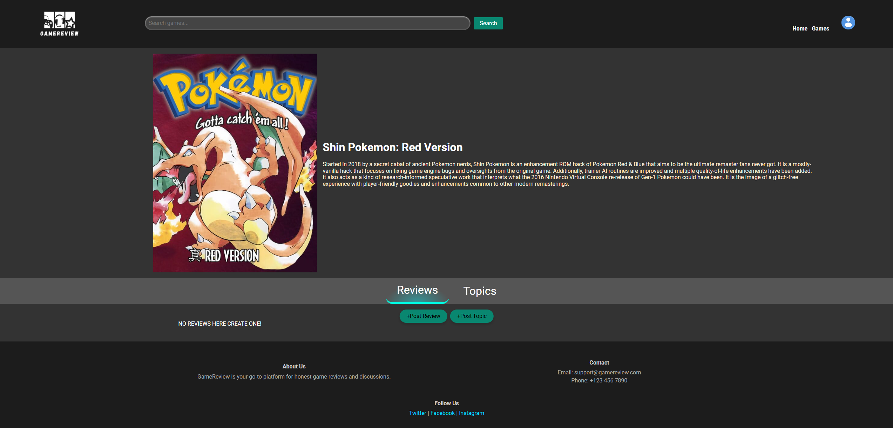
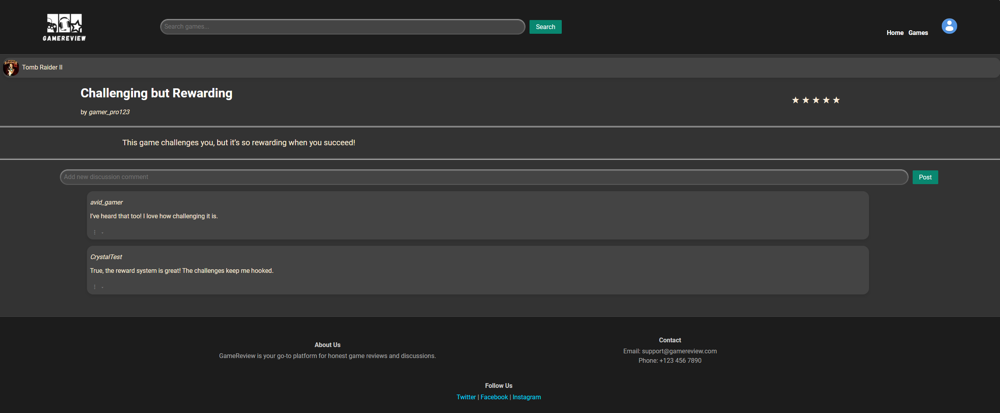
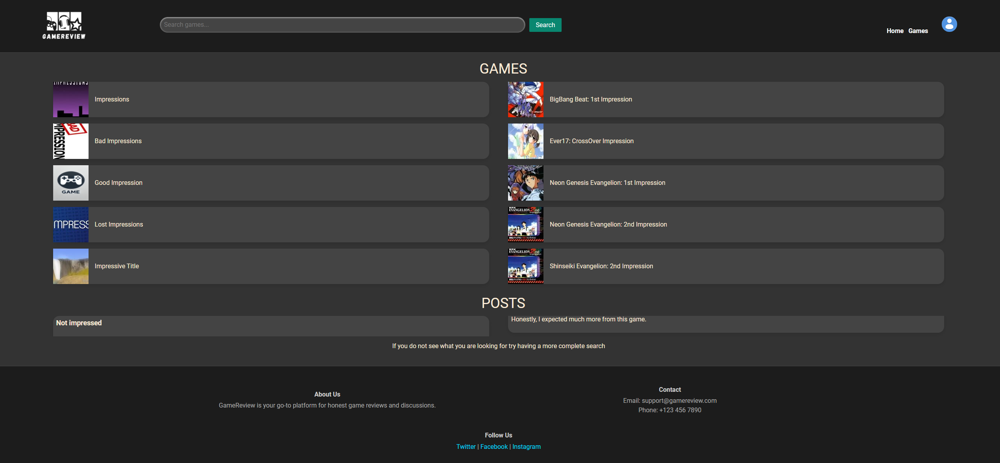

# Game Review

A game review and discussion platform built with a team of five for CSCI 5117 at the University of Minnesota. Think Reddit but for games — users can post reviews and start threaded discussions on any game in the IGDB database.

> **Note:** The live demo is no longer active as it was hosted on Render's free tier during the course.

---

## What it does

Search for any game and pull data straight from IGDB — cover art, summary, and genre. From there users can post rated reviews, start discussion topics, and reply in nested threads. The fuzzy search covers both the site's own content and the full IGDB catalog simultaneously. User profiles track review history and display a custom avatar.

## Stack

Node.js, Express, PostgreSQL, IGDB API

---

## Figma

https://www.figma.com/design/yl4nxmAKSPm4ww1B2vN6j5/GameReview?node-id=49-2361

---

## Screenshots

<em>Home — recently reviewed and newly added games</em>

 

<em>Game page — IGDB data alongside user reviews and discussion threads</em>

 

<em>Review page — rating, written review, and nested reply chain</em>

 

<em>Search — fuzzy match across site content and IGDB at once</em>

